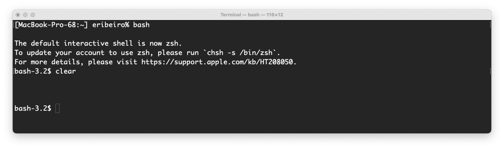
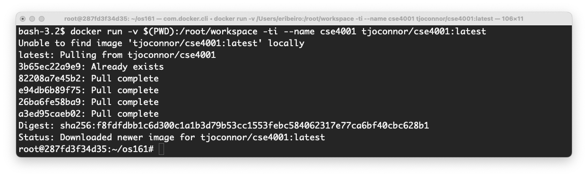
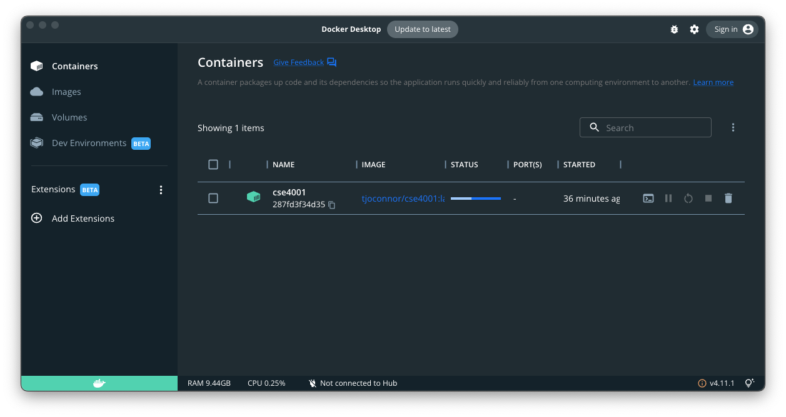
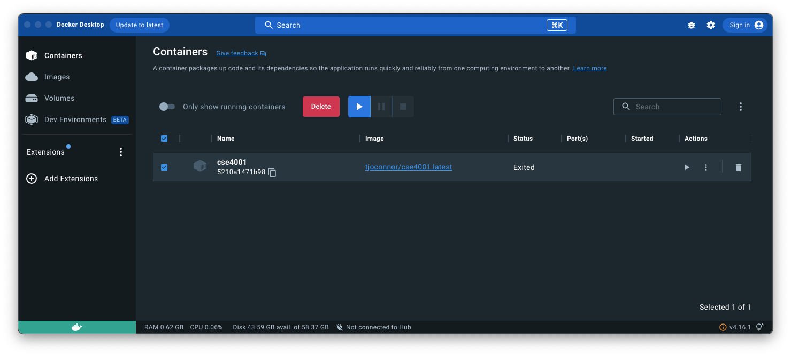
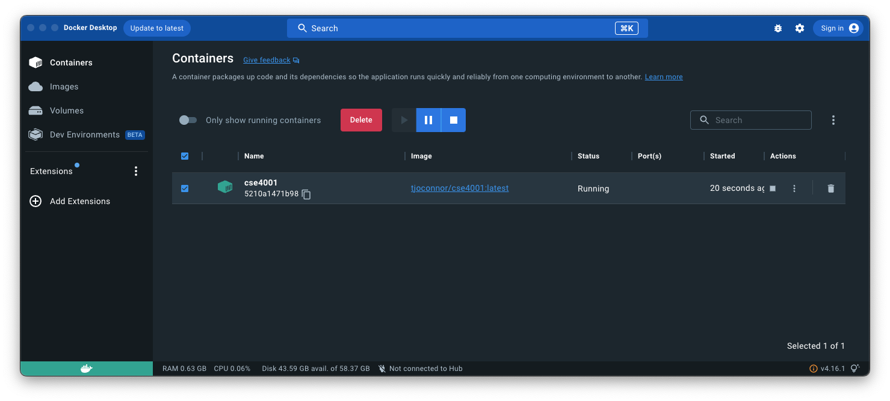
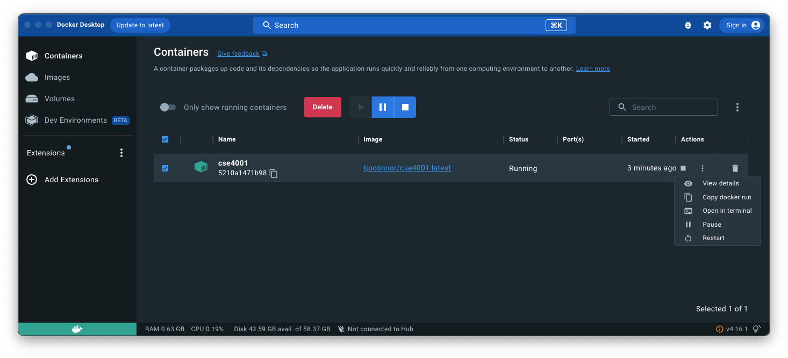
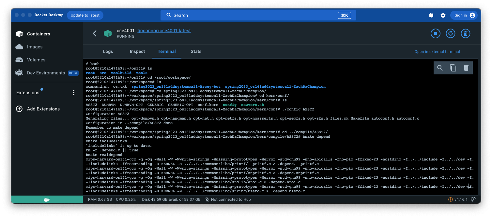
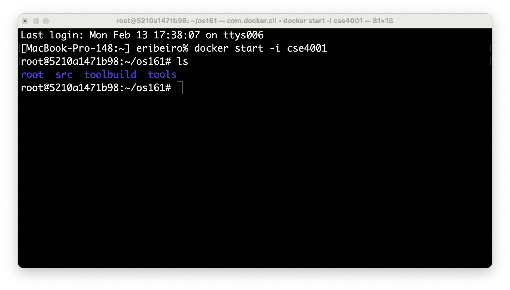
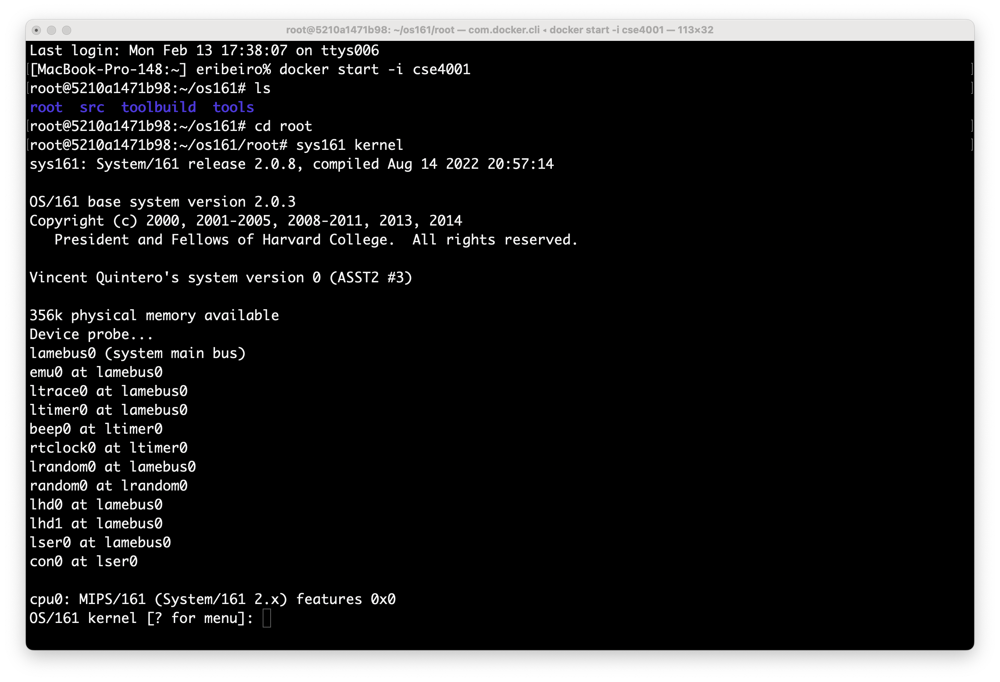
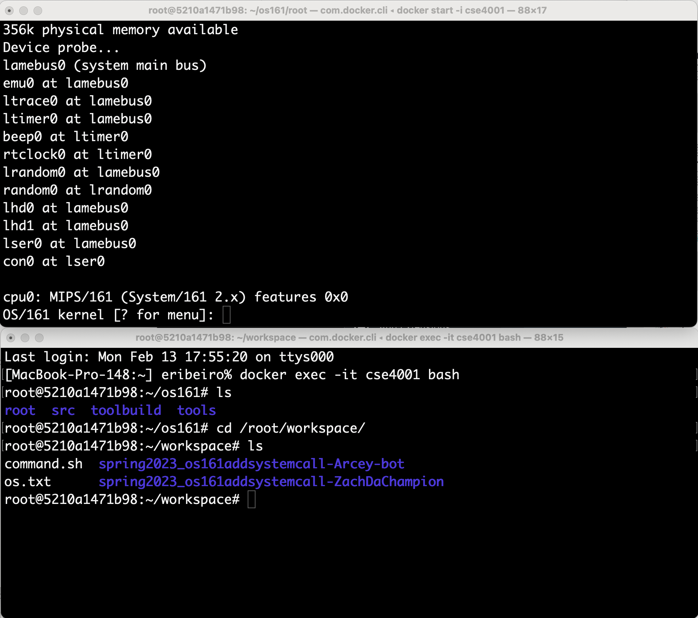

# Running the `cse4001` docker container

### Install Docker on your computer

Skip this step if Docker is already installed on your computer. To install Docker, follow the instructions from the following link: https://www.docker.com/products/docker-desktop/. 

### Get the CSE 4001 Docker container

Now that Docker is installed on your computer, it is time to get the actual container for `CSE4001`.  

The following commands include the bind/mount of a shared folder between the docker to your host computer. This shared folder allows you to keep your source code and development files (e.g., assignment code) on your computer while still accessible by the Docker container.  The shared folder is called `root/workspace/` on the Docker file system and is called `cse4001/` on the host computer (i.e., your computer). You can choose to place the shared folder anywhere in your file system. 

To download the docker container, we need to execute the `docker run` command. This command's syntax is a bit different for each OS platform, i.e.: 

###### Windows:

```shell
docker run -v "$(PWD):/root/workspace" -ti --name cse4001 tjoconnor/cse4001:latest
```

###### Linux/Intel Mac:

```shell
docker run -v $(PWD):/root/workspace -ti --name cse4001 tjoconnor/cse4001:latest
```

###### M1/M2 Mac:

```shell
docker run -v $(PWD):/root/workspace -ti --platform linux/amd64 --name cse4001 tjoconnor/cse4001:latest
```

#### Example (Intel Mac OS X)

This example shows how to download (and run) docker, and create a shared folder om an Intel Mac computer. The shared folder is located at `root/workspace` in the docker container, is located at `~/Desktop/cse4001` in the host computer.  

**Make sure your shell is** **bash**. Before running the `docker run` command, you need to ensure that you are using the bash shell (i.e., the `bash` command-line interpreter). The docker runs on a bash shell. If your terminal runs another shell, type `bash` to start a bash shell on the same terminal. 

Open the Unix terminal. To run the `bash` shell, simply type `bash` on your terminal, i.e.: 



Go inside the shared directory that you created. In this example, the shared directory on the host computer is `~/Desktop/cse4001`. 

```shell
cd ~/Desktop/cse4001/
```

From inside the host shared directory, execute the `docker run` command as follows:

```shell
docker run -v $(PWD):/root/workspace -ti --name cse4001 tjoconnor/cse4001:latest
```

The container is a large file so downloading it might take a few minutes. Once it is ready, the terminal will show the following information: 



This is now your Linux with OS/161 installed. There is (almost) nothing else that needs to be installed for CSE4001. However, if you need to install any other linux packages, you can do it using `apt-get` or similar package managers. 

In addition to the information displayed on the console, you should also see the container listed on the Docker Desktop application, i.e.: 



### Using the already installed CSE 4001 Docker container

If the container is already running, just click on the `terminal` icon besides the container name listed on the Docker Desktop. If it is not running, click on the `play` button and then click on the `terminal` icon to open the container's terminal. 


1. Start Docker Desktop.



​	**Figure 1**: Docker dashboard showing the cse4001 docker container. 


2. Boot the container by clicking on the Docker Desktop's `play` button (GUI's right-hand side).



​	**Figure 2**: Docker dashboard showing the cse4001 docker container after `play` button is clicked. 


3. Click on the three "vertical dots" on the right-hand side of the GUI to open a terminal: 



​	**Figure 3**: Opening a terminal window.

4. Change the shell to Bash and work on your OS/161.



​	**Figure 4**: Calling the OS/161 commands and navigate the directories. 


## Using the terminal(s)

I prefer to use the terminal to work with the `cse4001` Docker container. On my Mac OS, I use a combination of Docker Desktop interactions with command-line instructions. 

1. Start Docker Desktop 


​	**Figure 5**: Docker dashboard showing the `cse4001` docker container. 

2. Open a Terminal window and start the `cse4001` container.

```bash
docker start -i cse4001
```



​	**Figure 6**: Starting the `cse4001` Docker container from the terminal. 


3. Boot `OS/161` and work on its codebase to complete assignments. 



​	**Figure 7**: Booting `OS161`.


4. When working with `OS/161`, it is often useful to open multiple terminals on the same Docker container. To open another terminal on the same active container, type the following command on another terminal. 

 ```shell
 docker exec -it cse4001 bash
 ```

​    

**Figure 8**: Opening a second terminal running the same docker container. In one terminal, we can boot `OS161` (from the `os161/root` directory). In the other terminal, we can navigate the source code of assignments that are in the shared directory `/root/workspace`. Note that this `/root/` directory is not `OS161's root` directory. Instead, it is the root directory inside the `cse4001` Docker container. 

